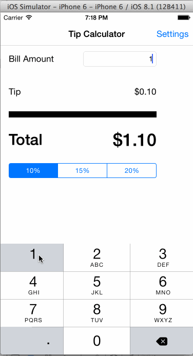

# CodePath iOS Bootcamp Pre-Work Tip Calculator Application

This is a simple Swift iOS application that calculates the tip and total amounts for a given bill amount.

Time spent: 4.0 hours spent in total (including documentation)

Completed user stories:

 * [x] Required: User can enter a bill amount
 * [x] Required: User can select from a preset list of tip percentages
 * [x] Required: The application updates the tip and total amounts as the bill amount changes
 * [x] Required: The application updates the tip and total amounts as the tip percentage changes
 * [x] Required: The application dismisses the numeric keypad when the user clicks anywhere on the application other than the keypad itself
 * [x] Required: User can enter and save (or cancel) the default tip percentage in the Settings View.

Notes:

Rather than using hardcoded tip percentages, the application obtains the tip percentages from the segmented control labels.

Walkthrough of all user stories:

GIF created with [LiceCap](http://www.cockos.com/licecap/).
